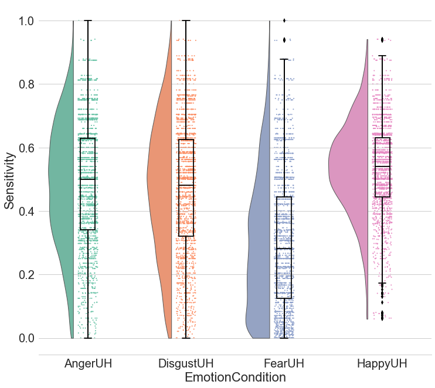

[](https://github.com/pog87/PtitPrince/actions/workflows/python_tests.yml)
[](https://pypi.org/project/ptitprince/)
[](https://pepy.tech/project/ptitprince)
[](https://anaconda.org/conda-forge/ptitprince/)
[](https://mybinder.org/v2/gh/RainCloudPlots/RainCloudPlots/master?filepath=tutorial_python%2Fraincloud_tutorial_python.ipynb)

# PtitPrince

A Python implementation of the "Raincloud plot"!
See: [https://github.com/RainCloudPlots/RainCloudPlots](https://github.com/RainCloudPlots/RainCloudPlots)

## Installation

You can install it via `pip`:

```
pip install ptitprince
```

or via `conda`:

```
conda install -c conda-forge ptitprince
```

or by cloning this repository and running the following from the root of it:

```
python setup.py install
```

## Academic use

To **cite Raincloud plots** please use the following information:

> Allen M, Poggiali D, Whitaker K et al. Raincloud plots: a multi-platform tool for robust data visualization [version 2; peer review: 2 approved]. Wellcome Open Res 2021, 4:63 (https://doi.org/10.12688/wellcomeopenres.15191.2)



## History of this project

This is a Python version of the "Raincloud plot" (or "PetitPrince plot", depending on the orientation) from R (under ggplot2) to Python.
The Raincloud plot is a variant of the violin plot written in R ggplot2 by [Micah Allen](https://web.archive.org/web/20210131133630/https://micahallen.org/2018/03/15/introducing-raincloud-plots/).
I found a tweet asking for a Python version of the Raincloud plot, and I agreed to give it a try.
Alas, the Python version for ggplot2 ([plotnine](https://github.com/has2k1/plotnine)) does not allow to create new styles in a comfortable way.
So I decided to write this package using the [seaborn](https://seaborn.pydata.org/) library as a foundation.

Then I replicated the plots from the original post by [Micah Allen](https://web.archive.org/web/20210131133630/https://micahallen.org/2018/03/15/introducing-raincloud-plots/), in Jupyter Notebooks and transformed that code into a Python package.

Since then, the package has received some publicity, and is for example listed in ["awesome-python-data-science"](https://github.com/thomasjpfan/awesome-python-data-science).

### Changelog

#### v.0.2.x

    * PtitPrince now relies on seaborn 0.10 and numpy >= 1.13
    * kwargs can be passed to the [cloud (default), boxplot, rain/stripplot, pointplot]
                     by preponing [cloud_, box_, rain_, point_] to the argument name.
    * End of support for python2, now the support covers python>=3.6

## Plans for the future:

 * ~~ask seaborn mantainers to add this new plot type~~ (not gonna happen)
 * ~~add a "move" option in seabon to control the positioning of each plot, as in ggplot2.~~ (either, added in ptitprince)
 * ~~get RainCloud published~~ (done!)
 * add logarithmic density estimate (LDE) to the options for the cloud
 * add the repeated measure feature
